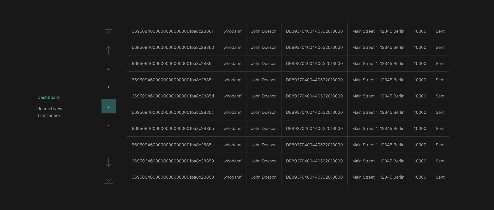

# Project Overview

This project is an accounting application designed to help manage financial transactions and track expenses. It provides a user-friendly interface for recording transactions, and uses redis as the simple storage.

## Installation

To install and run the accounting application, follow these steps:

1. Clone the repository `git clone git@github.com:c0okiemf/go-redis-vue-accounting-app.git`.
2. Navigate to the project directory `cd go-redis-vue-accounting-app`.
3. Execute the `./start.sh` script, which will start the Docker containers for the application, and wait until the building is finished.
4. The app is ready to use! Navigate to `http://localhost:8080/` to start using the app.
5. After you are done, you can run `./cleanup.sh` to remove images, cache, etc. created by docker-compose. WARNING! This will remove other stopped images and containers that you have on your system.

## Usage

Once the application is running, you can access it through your web browser at `http://localhost:8080`. The index route is the table view which will list transactions once they are added. You can add a new transaction by clicking the "Record New Transaction" button, which will take you to the form to add a new transaction. The main table view features pagination, so once you have more than 10 transactions, you can navigate through the pages to view older transactions.

## Tech

The application's backend is built with Go. The frontend is built with Vue. The application uses Redis as storage. It uses docker-compose for running the application in a containerized environment, and nginx to serve the frontend.

### Backend

The backend is built with Go and uses the Gin framework. The backend is responsible for handling requests from the frontend, and interacting with the Redis database. 
Swagger is used to document the API. Once the Docker image is running, you can access the Swagger documentation at `http://localhost:8081/swagger/index.html`.
The addTransaction request is validated server-side, using gin's built-in validation. Then, the errors object is parsed on the frontend to display the error messages to the user.

### Frontend

The frontend is built with Vue, specifically with the new Vue 3 Composition API. The frontend is responsible for displaying the data from the backend, and sending requests to the backend to add new transactions. 
It uses scss to allow for having a variable in the @media queries. Frontend is responsive, and can be viewed on mobile devices. Since table is not a good fit for mobile, it stretches over the screen limits and becomes scrollable on smaller screens.
The main table view features pagination. When more than 10 transactions are returned from the server, the user is able to click either page buttons or the "Next", "Previous", and "First", "Last" buttons to navigate through the pages.
The app also features a custom ToastNotification component, which is displayed either after a successful transaction addition, or when a non-validation error occurs. 
The record transaction form has some basic frontend validation (accountNumber, iban, and amount are required), but it also parses server side validation errors and displays them to the user.
Some functionality is separated into hooks (or composables), to allow for reusability and cleaner code.
There are sample unit tests written for the FormGroup component. For a production application, more tests would be written, and the coverage would be higher.
The application features both light and dark themes, which are automatically set based on the user's system preferences. The other theme can be easily tested with devtools by toggling light/dark scheme simulation.
